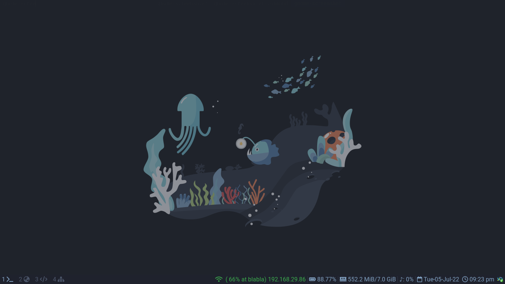

# Configarations
i3-wm based setup, this is my personal configarations for my linux setup.
It contains all the config files from my deivce... 

## Dependencies needed
- Font Awesome Free Icon pack
- Feh (for Wallpaper)
- xclip, maim (for ScreenShot)
- libgestures (for Gesture control)
- i3lock / i3color (Lockscreen)
- picom (for composition)
- xrandr (screen size set default to 1366x768)
- autotiling

# Screenshots
### Clean Desktop Look

### Usage 

